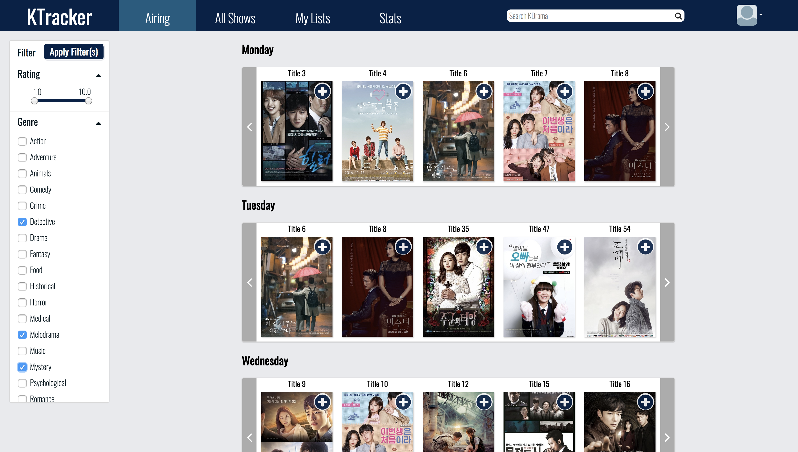
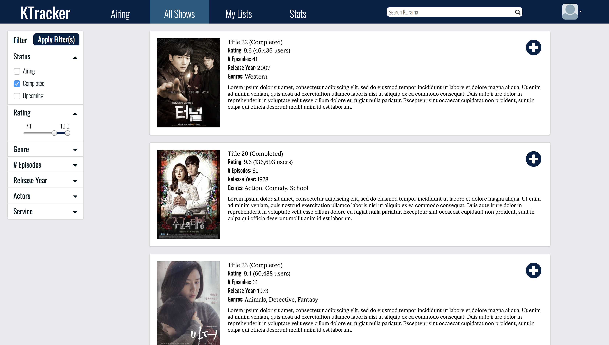
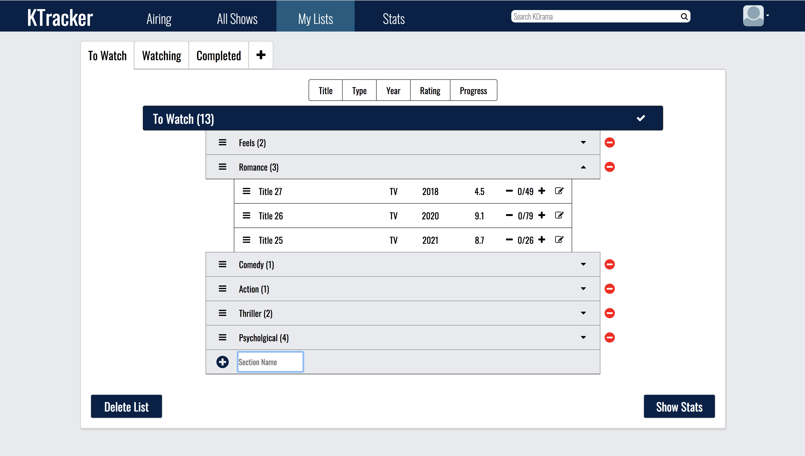
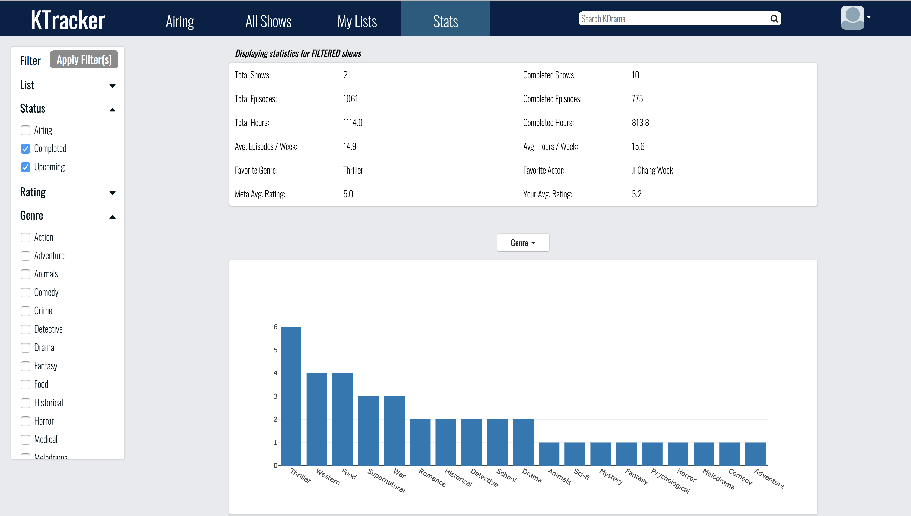

# MIT 6.813 User Interface Design & Implementation Project

## Description
Designed and implemented a user interface for KDrama (Korean Drama) viewers who have several difficulties finding and managing the shows they have seen, are watching, and plan to watch.

## Link
[https://web.mit.edu/jisoomin/www/6813](https://web.mit.edu/jisoomin/www/6813)  
*Optimized for Chrome desktop browser.*

## Final Report
[Google Doc](https://docs.google.com/document/d/12vn-tF6EU1qznetFzvD9nW-E6NElGVAfDQ_KbEt26GY/edit?usp=sharing)
[Youtube Video](https://youtu.be/uvOnMKvK4X8)

## Collaborators
Joseph Torres (<jmtorres@mit.edu>)  
Michael Feffer (<mfeffer@mit.edu>)  
Elijah Stiles (<edstiles@mit.edu>)

## Screenshots

